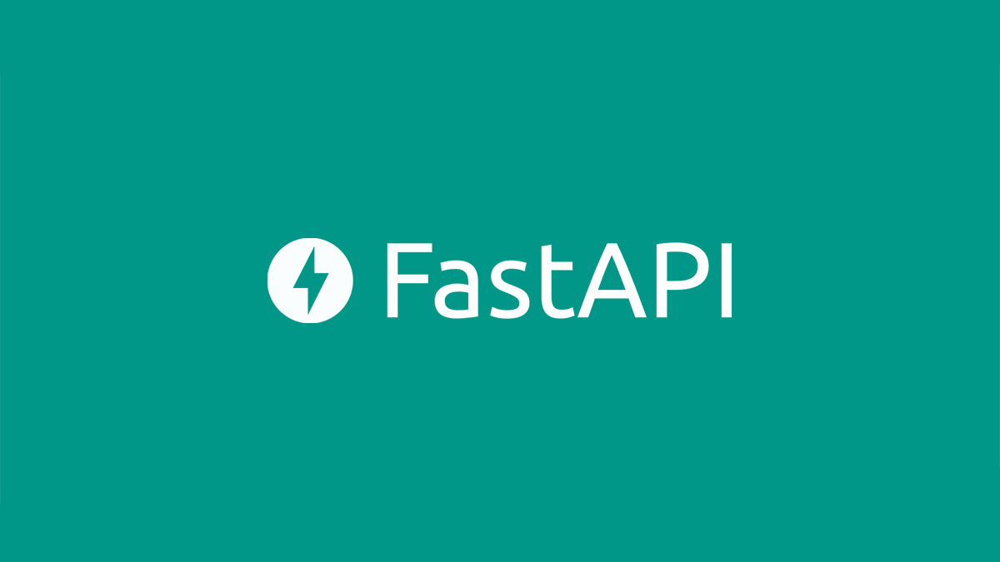

# Initial_FastAPI



이곳은 FastAPI에 대한 기본적인 사용법에 대해서 익히기 위해서 제작된 repository입니다.

## 🧐 FastAPI란?

---

**FastAPI**는 파이썬 프레임워크이다.  
우리가 알고있는 기존에 대중적으로 사용되고 있던 파이썬 프레임워크는 **Django, Flask**이다. **비교적 가벼운 웹개발**이라면 **Flask**를 사용했고 조금 더 **볼륨있는 프로젝트**라면 Django를 사용했다.

하지만, 이 쌍둥이 타워 사이에 "조작법은 단순하면서도 성능적으로는 우세함을 보장한다"는 **FastAPI**라는 녀석이 비집고 들어온 것이다.

별도의 구성이나 설치의 필요없이 바로 사용할 수 있는 <span style="color:red">비동기적인 특성을 가진 프레임워크</span>이기 때문이다.

## 😓 FastAPI 특징

---

- API 문서 자동 생성 (Swagger와 ReDoc 스타일 동일)
- 의존성 주입 위주의 설계를 통한 DB 등에 대한 관리 편리
- 비동기 동작으로 빠른 성능 보장
- Pydantic을 사용한 Validation 체크
- 뛰어난 공식문서 가이드

## 🤓 FastAPI 사용하기

---

**FastAPI**를 사용하는 방법을 간단하게 정리하였습니다.

1. fastapi 설치 : `pip install fastapi`
2. uvicorn 설치 :
   `pip install uvicorn` , `pip install uvicorn[standard]`

```
uvicorn?
uvicorn은 async/await을 기반한 비동기 프로그래밍 지원, 퍼포먼스가 가장 좋다고 알려진 ASGI이다.
본 페이지 내, 실행 결과에 대해 확인하기 위한 용도로 설치
```

**간단하게 Hello World 메시지를 띠우는 코드를 작성하였다.**

```python
from fastapi import FastAPI

app = FastAPI()


@app.get("/")
async def root():
    return {"message": "Hello World"}

```
