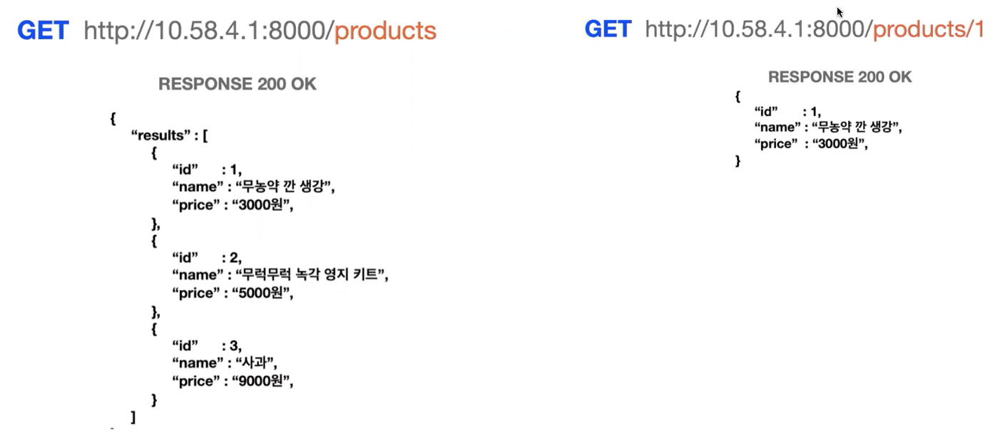
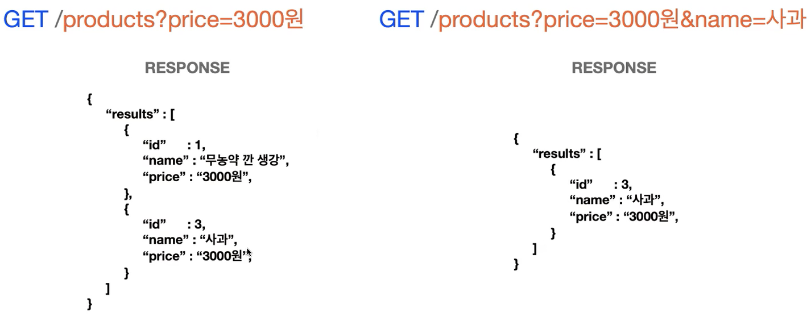
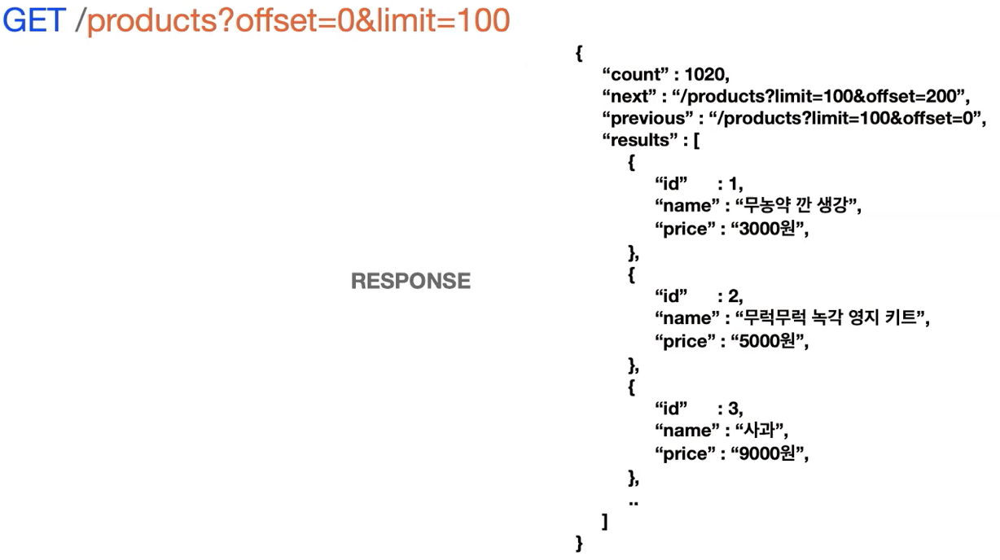

## 🤔 오늘은 무엇을 공부했는가? (07/12)

---

오늘은 Path 파라미터와 Query 파라미터에 대한 내용을 정리하라는 숙제를 받아서 정리해보려고 한다.

우선 Path 파라미터와 Query 파리미터에 대해서 알아보기 전에 Rest API에 대해서 정리하면 좋을 것 같아서
정리하려고 한다.

### REST API

---

**Re**presentational **S**tate **T**ransfer의 약자로,

```python
어떠한 자원에 대한 CRUD요청을 HTTP Method로 표현하고 HTTP URI로 요청을 보내는 모든 것을 일컫는다.
```

- 웹에 존재하는 모든 자원(이미지, 동영상, 텍스트 등 **데이터)**에 고유한 URI를 부여하여 해당 자원에 대한 주소를 부여하는 것!
- 웹 서비스를 만드는데 사용되는 제약(constraint)의 모음!
  이 까다로운 제약들을 모두 만족해서 만들면 **‘RESTful’ 하다**고 한다

한미디로 자원에 대해 URI를 지정하고 자원에 대한 행위를 Http Method로 표현하는 것을 말한다.

**REST의 구성요소**

- 자원 : URI
- 행위 : Http Method
- 표현 : 클라이언트 - 서버 간 데이터를 주고받는 형태를 말하는 것으로 JSON, XML이 대표적이다.

## ✓ Path Parameter / Query Parameter

---

RESTful API는 Path Parameter 또는 Query Parameter로 통신할 수 있다.

### Path Parameter

---

Path parameter는 웹 개발에서 API 엔드포인트의 경로(URL) 일부에 포함되는 동적인 값을 나타내는 매개변수 입니다.

일반적으로 API 엔드포인트의 경로는 리소스를 식별하기 위해 사용되며, 경로 내의 일부 세그먼트는 경로 매개변수로 대체될 수 있습니다.

경로 매개변수는 경로 세그먼트 내에 중괄호 `{}`로 표시됩니다.  
이를 통해 클라이언트는 요청을 보낼 때 동적인 데이터를 경로에 포함시킬 수 있습니다.  
서버는 해당 경로 매개변수의 값에 따라 요청을 처리하고 응답을 반환합니다.



Product를 받아오는 Get 요청이다.

위와 같이 **특정한 하나의 데이터 또는 정제되지 않은 데이터가 필요할 경우에 사용될 수 있다.**


새로운 데이터를 추가하는 POST 요청과 데이터를 갱신하는 PATH 요청이다.

**POST**

이름이 '무농약 깐 생강'이며 가격이 3000원인 데이터를 추가하고자 데이터를 request body에 담아 보내고 있다.

**PATCH**

id가 1번인 상품에 대해 가격을 수정하고자 수정하고픈 데이터 내용을 request body에 담아 요청하고 있다.

**_처럼 클라이언트가 원하는 요청에 대한 데이터를 request body로 보내면 서버는 이를 받아 처리한다._**

```python
PATCH는 데이터를 갱신하는 메서드인데, 전체 데이터를 수정하는 것이 PUT이라면
PATCH는 특정 하나의 내용을 수정할 때 사용된다.
```


특정 데이터에 대한 id 값을 보내며 데이터 삭제를 요청하는 DELETE 메서드이다.

삭제할 데이터에 대한 여러 정보를 굳이 나열하여 보내는 것은 불필요하기 때문에 id값만 URI에 포함하여 요청을 보내고 있다.

### Query String

---

uery parameter는 웹 주소(Uniform Resource Locator, URL)의 일부로서, 웹 페이지 또는 웹 애플리케이션에 전달되는 추가 정보를 담고 있는 키-값 쌍입니다. 일반적으로 URL의 끝에 "?" 기호를 사용하여 표시되며, 이후에 키=값 형식으로 추가 정보가 나열됩니다.

**Filtering**



특정 조건에 맞는 데이터를 받아오는 GET요청이다.

**이와 같이 조건에 맞게 데이터를 정제하여 불러올 때 사용할 수 있다.**

**Ordering**


역순으로 데이터를 ordering하여 보내줄 것을 요청하는 GET 메서드이다. 서버는 Query String을 받아 클라이언트가 원하는 방식으로 데이터를 보내주고 있다.

**Pagenation**



주로 원하는 만큼 데이터를 불러오는 Pagnation이다. offset 0번부터 시작하여 100개의 데이터를 요청하고 있다.

이렇게 Query String은 원하는 조건을 주어 데이터를 정제하여 가져오는 경우에 사용할 수 있다.

### Path Parameter vs Query Parameter

---

Path Parameter와 Query Parameter는 때에 따라 같은 결과를 가져오기도 한다. 그렇다면 각각의 방식은 어떨 때 가장 적합할까?

### Path Parameter

---

전체 데이터 또는 특정 하나의 데이터를 다룰 때 사용한다.

### Query Parameter

---

Query String은 filtering, ordering, searching에 많이 사용한다.
